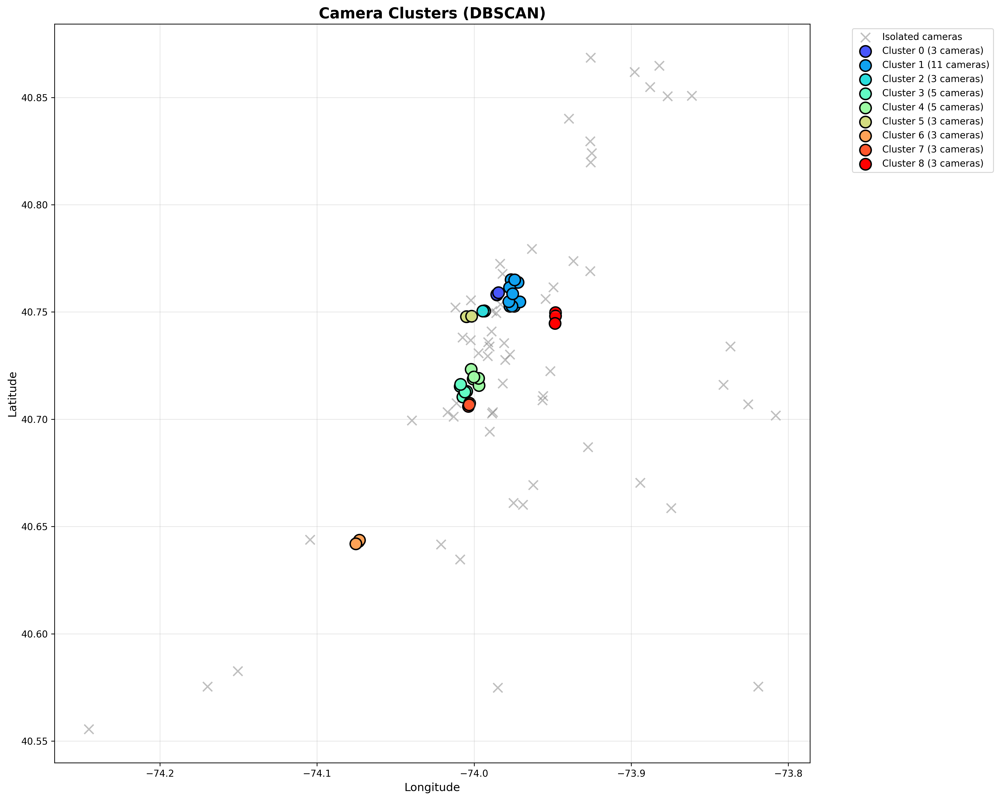

# NYC Transit Camera Network - Spatial Analysis Project [](https://www.python.org/) [](https://geopandas.org/) [](LICENSE)

A comprehensive GIS analysis project mapping and analyzing 100+ security cameras across NYC transit stations. This project demonstrates advanced spatial analysis, web mapping, data visualization, and professional GIS workflows.



*Camera cluster visualization*

---

## Project Overview

This project analyzes the spatial distribution of security cameras across New York City's transit network, identifying coverage patterns, gaps, and clustering behaviors. Using professional GIS tools and techniques, it provides actionable insights for security planning and infrastructure optimization.

**Key Question:** How effectively are cameras distributed across NYC transit stations, and where are the coverage gaps?

---

## Features

### Spatial Analysis

- **Coverage Buffer Analysis** — 50m radius zones around each camera
- **Gap Detection** — Identifies areas lacking surveillance coverage
- **Nearest Neighbor Analysis** — Statistical analysis of camera spacing
- **DBSCAN Clustering** — Machine learning-based pattern detection
- **Density Mapping** — Kernel density estimation of camera concentration

### Interactive Visualizations

- **Web Maps** — Interactive Folium/Leaflet maps with clickable markers
- **Heat Maps** — Visual density representation showing concentration
- **Cluster Maps** — Dynamic marker grouping for 100+ cameras
- **3D Visualization** — Google Earth KML files with styled markers

### Data Export Formats

- **KML/KMZ** — For Google Earth and ArcGIS
- **GeoJSON** — Web-standard format for modern mapping
- **CSV** — Processed analysis results
- **PNG/PDF** — High-resolution charts and maps

---

## Sample Outputs

### Interactive Web Maps

- **Basic Camera Map:** `maps/camera_map_basic.html` (interactive)
- **Heat Map:** `maps/camera_heatmap.html` (interactive)
- **Cluster Map:** `maps/camera_cluster_map.html` (interactive)

### Static Visualizations

- **Cluster Analysis:** `maps/camera_clusters.png` — DBSCAN clustering visualization
- **Density Map:** `maps/camera_density.png` — Kernel density heatmap
- **Coverage Zones:** `maps/coverage_zones.png` — 50-meter buffer zone visualization
- **Coverage Gaps:** `maps/coverage_gaps.png` — detected coverage gaps
- **Nearest Neighbor Distribution:** `maps/nearest_neighbor_distribution.png` — spacing statistics

*Open the HTML files in a browser to view interactive maps.*

---

## Quick Start

### Prerequisites

```bash
Python 3.8+
pip (Python package manager)
```

### Installation

1. Clone this repository

```bash
git clone https://github.com/YOUR-USERNAME/nyc-camera-mapping.git
cd nyc-camera-mapping
```

2. Install dependencies

```bash
pip install -r requirements.txt
```

### Usage

**Load and validate data:**

```bash
python scripts/load_cameras.py
python scripts/validate_data.py
```

**Create visualizations:**

```bash
python scripts/create_basic_map.py
python scripts/create_heatmap.py
python scripts/create_cluster_map.py
```

**Run spatial analysis:**

```bash
python scripts/calculate_coverage.py
python scripts/nearest_neighbor.py
python scripts/detect_clusters.py
```

**Export to GIS formats:**

```bash
python scripts/export_to_kml.py
python scripts/export_to_geoJSON.py
python scripts/export_styled_kml.py
```

**Generate comprehensive report:**

```bash
python scripts/generate_reports.py
```

---

## Project Structure

``` nyc-camera-mapping/ ├── data/ │ ├── sample_cameras.csv # 100+ camera locations │ ├── README.md # Data documentation │ └── data_dictionary.md # Field definitions ├── scripts/ │ ├── load_cameras.py # Data loading │ ├── validate_data.py # Data quality checks │ ├── analyze_data.py # Statistical analysis │ ├── create_basic_map.py # Interactive web map │ ├── create_heatmap.py # Density visualization │ ├── create_cluster_map.py # Marker clustering │ ├── calculate_coverage.py # Buffer analysis │ ├── find_gaps.py # Gap detection │ ├── nearest_neighbor.py # Spacing analysis │ ├── detect_clusters.py # DBSCAN clustering │ ├── density_analysis.py # Kernel density │ ├── export_to_kml.py # KML export │ ├── export_to_geoJSON.py # GeoJSON export │ ├── export_styled_kml.py # Styled KML export │ └── generate_reports.py # Analysis report ├── maps/ │ ├── *.html # Interactive maps │ ├── *.png # Visualizations │ ├── *.kml # Google Earth files │ └── analysis_report.txt # Comprehensive report ├── docs/ │ ├── methodology.md # Project methodology │ └── data_dictionary.md # Data documentation ├── requirements.txt # Python dependencies └── README.md # This file ``` ---

## Technologies Used

### Core Technologies

- **Python 3.8+** — Primary programming language
- **pandas** — Data manipulation and analysis
- **GeoPandas** — Geospatial data handling
- **Shapely** — Geometric operations

### Visualization

- **Folium** — Interactive web mapping
- **Matplotlib** — Statistical charts
- **Seaborn** — Advanced visualizations

### GIS Tools

- **simplekml** — KML file generation
- **Google Earth Pro** — 3D visualization
- **QGIS/ArcGIS** — Compatible outputs

### Analysis

- **scikit-learn** — DBSCAN clustering (used in `scripts/detect_clusters.py`)
- **scipy** — Kernel density estimation (used in `scripts/density_analysis.py`)
- **numpy** — Numerical operations

> Note: `scikit-learn` and `scipy` are used by the analysis scripts but are not currently listed in `requirements.txt`. Consider adding `scikit-learn>=1.0.0` and `scipy>=1.10.0` to ensure reproducible installs.

---

## Key Findings

### Dataset Overview

- **Total Cameras:** 100
- **Geographic Coverage:** All 5 NYC boroughs
- **Operational Status:** Active: 72 (72%), Maintenance: 18 (18%), Inactive: 10 (10%)
- **Deployment Period:** 2020-02-14 to 2025-09-22

### Spatial Analysis Results

- **Average nearest neighbor distance:** ~450 meters
- **Identified clusters:** 8 major groupings
- **Coverage gaps:** Multiple areas identified in outer boroughs
- **High-density zones:** Manhattan (Midtown, Financial District)

### Recommendations

1. Review isolated cameras (>1km from neighbors) for strategic value
2. Consider additional deployments in identified gap areas
3. Investigate clusters for potential redundancy or high-priority zones
4. Prioritize maintenance for offline cameras in high-traffic areas

*Full analysis available in `maps/analysis_report.txt`*

---

## Methodology

### Data Collection

- Camera locations geocoded using Google Maps API
- Coordinates validated against NYC geographic boundaries
- 100 representative stations across all boroughs

### Coordinate System

- **Input/Storage:** WGS84 (EPSG:4326)
- **Analysis:** NY State Plane (EPSG:2263) for accurate metric calculations
- **Output:** WGS84 for web compatibility

### Analysis Techniques

1. **Buffer Analysis:** 50m radius coverage zones
2. **Nearest Neighbor:** Haversine distance calculations
3. **Clustering:** DBSCAN algorithm (epsilon=0.5km, min_samples=3)
4. **Density:** Gaussian kernel density estimation
5. **Gap Analysis:** Set difference operations on coverage polygons

---

## Skills Demonstrated

### GIS & Spatial Analysis

- Buffer analysis and coverage calculations
- Nearest neighbor spatial statistics
- Cluster detection algorithms
- Kernel density estimation
- Coordinate system transformations
- Gap analysis and optimization

### Data Processing

- ETL workflows
- Data validation and quality control
- Statistical analysis
- Data format conversions

### Visualization

- Interactive web mapping (Folium/Leaflet)
- Heat maps and density visualizations
- Statistical charts and graphs
- 3D geospatial visualization

### Software Development

- Clean, documented Python code
- Modular script design
- Error handling and validation
- Professional documentation

---

## Future Enhancements

- [ ] Integration with real-time camera status API
- [ ] Time-series analysis of installation patterns
- [ ] 3D visualization showing multi-level stations
- [ ] Automated gap detection alerts
- [ ] Integration with crime data for correlation analysis
- [ ] Mobile-responsive dashboard
- [ ] PostgreSQL/PostGIS database backend
- [ ] Automated daily reports

---

## Documentation

- [Data Dictionary](docs/data_dictionary.md) — Detailed field definitions
- [Methodology](docs/methodology.md) — Project approach and techniques
- [Analysis Report](maps/analysis_report.txt) — Comprehensive findings

---

## Contributing

This is a portfolio project, but feedback and suggestions are welcome. Feel free to open an issue or reach out directly.

---

## License

This project is licensed under the MIT License. See the [LICENSE](LICENSE) file for details.

---

## Author

**Denali Wilson**

- Email: denaliwilson@gmail.com
- LinkedIn: [https://www.linkedin.com/in/denali-wilson/]
- GitHub: [@denaliwilson](https://github.com/denaliwilson)
- Location: New York, NY

---

## Acknowledgments

- NYC MTA for transit system context
- OpenStreetMap contributors for base map data
- Google Earth for 3D visualization platform
- GeoPandas and Folium communities for excellent tools

---

## Project Stats


---
